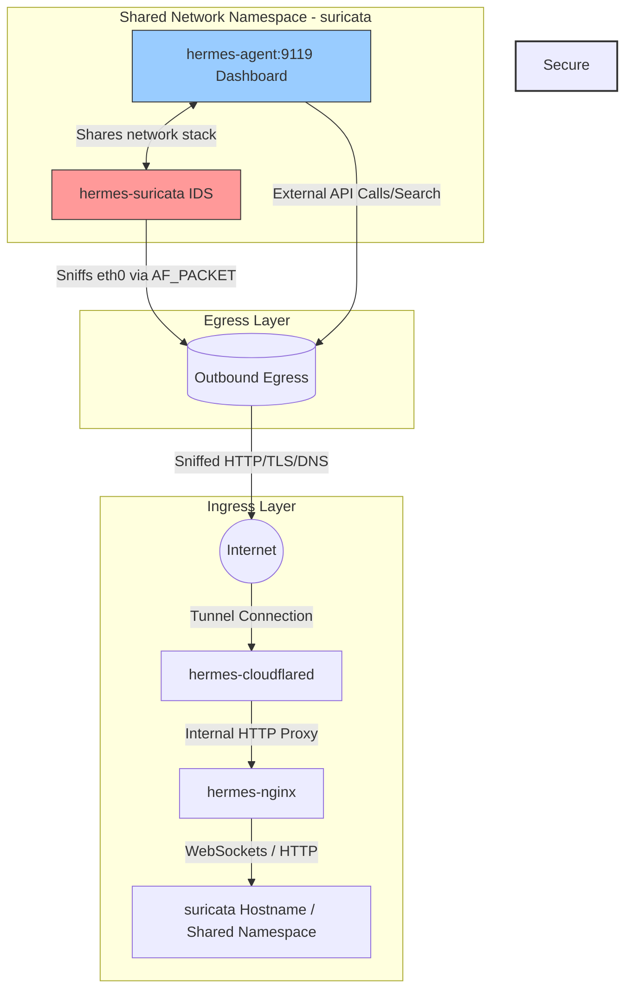

# Secure Hermes Agent Host Stack

A production-ready, highly secure, and egress-monitored Docker Compose deployment for the Nous Research **Hermes Agent**. 

This stack features a multi-tiered ingress layer routed through a Cloudflare Tunnel and Nginx reverse proxy, coupled with inline egress packet sniffing using a **Suricata Intrusion Detection System (IDS)** inside a shared network namespace.

---

## 📐 Architecture Design

The following diagram illustrates how external traffic safely reaches the agent dashboard (Ingress), and how all outbound requests from the agent are analyzed inline by Suricata before hitting the internet (Egress):


### Network Flow Flowchart


---

## 🛡 Why We Need These Services in Docker

Each component is dockerized and orchestrated to fulfill a distinct architectural and security role:

### 1. Cloudflared (Ingress Tunnel)
*   **Why we need it**: It establishes an outbound-only connection to Cloudflare’s edge network, mapping a public domain to our local Nginx reverse proxy.
*   **Security Value**: This eliminates the need to perform port forwarding on your router, allocate public static IPs, or expose ports directly to the public internet, rendering the host system invisible to external port scans.

### 2. Nginx (Reverse Proxy & Edge Controller)
*   **Why we need it**: Acts as the traffic cop sitting in front of the agent dashboard.
*   **Security Value**: 
    *   Injects security headers (`X-Frame-Options`, `Content-Security-Policy`, etc.) to prevent clickjacking and session hijacking.
    *   Implements rate-limiting to prevent brute force or Denial of Service (DoS) attacks on the dashboard.
    *   Handles the WebSocket protocol upgrade mapping required for `ttyd`'s embedded browser-based terminal connection.

### 3. Hermes Agent (AI Core & Web Dashboard)
*   **Why we need it**: Houses the actual Nous Research AI agent. It runs the FastAPI dashboard service, serving the interface and PTY terminal on port `9119`.
*   **Security Value**: Containers isolate the agent's file operations from the host system. Crucially, the container runs in **network client mode** (`network_mode: "service:hermes-suricata"`), meaning it has no independent network adapter and shares Suricata's network namespace.

### 4. Suricata (Egress Intrusion Detection System)
*   **Why we need it**: Analyzes network packets flowing out of the AI agent.
*   **Security Value**: Because LLM agents can run arbitrary code, execute terminal commands, and perform tool-based web requests, they are highly susceptible to prompt injection, jailbreaks, or command hijacking. An attacker could force the agent to download malicious scripts, trigger reverse shells, or exfiltrate sensitive data. Suricata acts as an independent network-level firewall and audit logger, sniffing all outbound and inbound traffic on the virtual interface.
*   **What makes Suricata outstanding in this setup**:
    *   **Zero-Bypass Network Namespace Sharing**: By leveraging Docker's `network_mode: "service:hermes-suricata"`, the Hermes Agent container does not have its own network interface. It routes all traffic directly through Suricata's network stack. The agent cannot bypass or disable the monitoring engine because they share the exact same kernel network namespace.
    *   **Least Privilege Isolation**: Traditional network sniffing requires running tools in host networking mode (`--net=host`), exposing the entire host's interfaces. Suricata operates solely inside the isolated container network namespace, using `CAP_NET_RAW` to capture packets via `AF_PACKET` on `eth0`. Even if Suricata itself is targeted by a packet-parser exploit, the attack is fully sandboxed inside the container namespace.
    *   **High Performance AF_PACKET Zero-Copy**: Suricata utilizes Linux `AF_PACKET` in zero-copy ring buffer mode. This allows it to capture and inspect packets directly from kernel space memory with extremely low latency, ensuring no performance penalty is imposed on the AI agent's inference and network requests.
    *   **Dynamic Protocol & Application-Layer Detection**: Attackers often try to hide malicious traffic by running it over standard ports (e.g., reverse shells over port 443). Suricata decodes application-layer protocols dynamically (HTTP, TLS, DNS, SSH, SMTP) regardless of the port number, extracting and auditing TLS Server Name Indication (SNI), DNS query logs, and HTTP request headers.
    *   **Unified IDS and Logging (Eve JSON)**: Suricata does not just alert on matches against rules; it acts as a comprehensive Network Security Monitor (NSM). It outputs unified, structured JSON logs (`eve.json`) detailing every flow, DNS transaction, and TLS negotiation, facilitating immediate integration with SIEMs or custom log parsers.

---

## ⚙ Setup & Operation

### 1. Pre-requisites
Ensure you have **Docker** and **Docker Compose** installed (or Colima running on macOS). 

### 2. Configure Environment Variables
Create a `.env` file in the root directory by copying the sample template:
```bash
cp .env.sample .env
```
Then configure your API keys inside `.env`:
```env
CLOUDFLARE_TUNNEL_TOKEN=your_cloudflare_tunnel_token

# Provider keys (optional but recommended)
DEEPINFRA_API_KEY=your_deepinfra_key
AWS_ACCESS_KEY_ID=your_aws_key
AWS_SECRET_ACCESS_KEY=your_aws_secret_key
BRAVE_API_KEY=your_brave_search_key
PERPLEXITY_API_KEY=your_perplexity_key
```

### 3. Run the Stack
Start all services in detached mode:
```bash
docker-compose up -d
```

### 4. Monitor Security Alerts
To check Suricata's alerts in real time:
```bash
tail -f suricata_log/fast.log
```
Or to inspect structured event transactions:
```bash
tail -f suricata_log/eve.json
```
