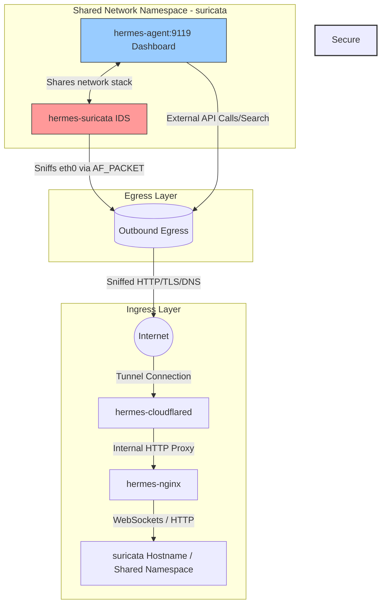

# Secure Hermes Agent Host Stack

A production-ready, highly secure, and egress-monitored Docker Compose deployment for the Nous Research **Hermes Agent**. 

This stack features a multi-tiered ingress layer routed through a Cloudflare Tunnel and Nginx reverse proxy, coupled with inline egress packet sniffing using a **Suricata Intrusion Detection System (IDS)** inside a shared network namespace.

---

## 📐 Architecture Design

The following diagram illustrates how external traffic safely reaches the agent dashboard (Ingress), and how all outbound requests from the agent are analyzed inline by Suricata before hitting the internet (Egress):



---

## 🛡 Why We Need These Services in Docker

Each component is dockerized and orchestrated to fulfill a distinct architectural and security role:

### 1. Cloudflared (Ingress Tunnel)
*   **Why we need it**: It establishes an outbound-only connection to Cloudflare’s edge network, mapping a public domain to our local Nginx reverse proxy.
*   **Security Value**: This eliminates the need to perform port forwarding on your router, allocate public static IPs, or expose ports directly to the public internet, rendering the host system invisible to external port scans.

### 2. Nginx (Reverse Proxy & Edge Controller)
*   **Why we need it**: Acts as the traffic cop sitting in front of the agent dashboard.
*   **Security Value**: 
    *   Injects security headers (`X-Frame-Options`, `Content-Security-Policy`, etc.) to prevent clickjacking and session hijacking.
    *   Implements rate-limiting to prevent brute force or Denial of Service (DoS) attacks on the dashboard.
    *   Handles the WebSocket protocol upgrade mapping required for `ttyd`'s embedded browser-based terminal connection.

### 3. Hermes Agent (AI Core & Web Dashboard)
*   **Why we need it**: Houses the actual Nous Research AI agent. It runs the FastAPI dashboard service, serving the interface and PTY terminal on port `9119`.
*   **Security Value**: Containers isolate the agent's file operations from the host system. Crucially, the container runs in **network client mode** (`network_mode: "service:hermes-suricata"`), meaning it has no independent network adapter and shares Suricata's network namespace.

### 4. Suricata (Egress Intrusion Detection System)
*   **Why we need it**: Analyzes network packets flowing out of the AI agent.
*   **Security Value**: Because LLM agents can run code, execute terminal shell commands, and interact with the web, they are susceptible to "jailbreaks" or prompt injections that could cause them to download malicious assets, trigger reverse shells, or leak data. Suricata sits directly on the shared network adapter (`eth0`), auditing all outbound requests (DNS queries, TLS SNI, HTTP hosts) and immediately flagging anomalies (such as reverse shells or blacklisted IP calls).

---

## ⚙ Setup & Operation

### 1. Pre-requisites
Ensure you have **Docker** and **Docker Compose** installed (or Colima running on macOS). 

### 2. Configure Environment Variables
Create a `.env` file in the root directory (template pre-created) and configure your API keys:
```env
CLOUDFLARE_TUNNEL_TOKEN=your_cloudflare_tunnel_token

# Provider keys (optional but recommended)
DEEPINFRA_API_KEY=your_deepinfra_key
AWS_ACCESS_KEY_ID=your_aws_key
AWS_SECRET_ACCESS_KEY=your_aws_secret_key
BRAVE_API_KEY=your_brave_search_key
PERPLEXITY_API_KEY=your_perplexity_key
```

### 3. Run the Stack
Start all services in detached mode:
```bash
docker-compose up -d
```

### 4. Monitor Security Alerts
To check Suricata's alerts in real time:
```bash
tail -f suricata_log/fast.log
```
Or to inspect structured event transactions:
```bash
tail -f suricata_log/eve.json
```
