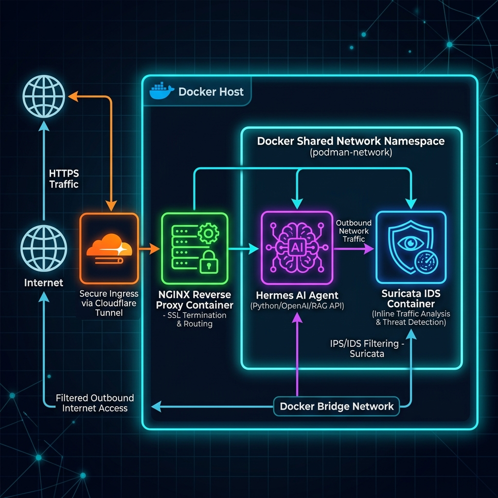
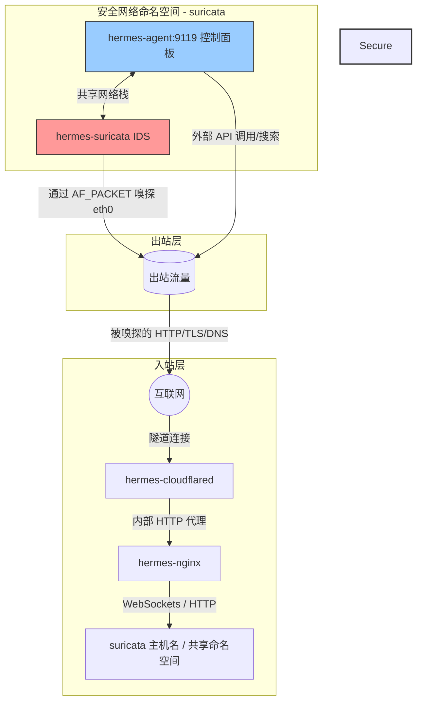

# 安全 Hermes Agent 主机技术栈

适用于 Nous Research **Hermes Agent** 的生产就绪、高度安全且支持出站流量监控的 Docker Compose 部署包。

本部署方案具备由 Cloudflare Tunnel 和 Nginx 反向代理构建的多层入站防御，并结合了在共享网络命名空间内运行的 **Suricata 入侵检测系统 (IDS)** 进行内联出站数据包嗅探。

---

## 📐 架构设计

下图展示了外部流量如何安全地到达 Agent 控制面板（入站），以及 Agent 的所有出站请求在访问互联网之前如何被 Suricata 进行内联分析（出站）：



### 网络流向图


---

## 🛡 为什么我们需要在 Docker 中运行这些服务

每个组件都经过容器化与精心编排，以满足特定的架构和安全职责：

### 1. Cloudflared (入站隧道)
*   **为什么需要它**：它建立一个仅出站的连接到 Cloudflare 边缘网络，将公共域名映射到我们本地的 Nginx 反向代理。
*   **安全价值**：免去了在路由器上配置端口转发、分配公网静态 IP 或将端口直接暴露给公网的风险，使宿主机在外部端口扫描中处于完全隐身状态。

### 2. Nginx (反向代理与边缘控制器)
*   **为什么需要它**：作为 Agent 控制面板前侧的流量管理器。
*   **安全价值**：
    *   注入安全响应头（`X-Frame-Options`、`Content-Security-Policy` 等），防范点击劫持和会话劫持。
    *   实现限流机制，以防止针对控制面板的暴力破解或拒绝服务 (DoS) 攻击。
    *   处理 `ttyd` 内嵌浏览器终端所需的 WebSocket 协议升级情境。

### 3. Hermes Agent (AI 核心与 Web 控制面板)
*   **为什么需要它**：托管 Nous Research AI Agent 本身。它在端口 `9119` 上运行 FastAPI 控制面板服务，提供 Web 界面与 PTY 终端连接。
*   **安全价值**：容器将 Agent 的文件操作与宿主机隔离。至关重要的是，该容器运行在**网络客户端模式** (`network_mode: "service:hermes-suricata"`)，这意味着它没有独立的网络适配器，而是共享 Suricata 的网络命名空间。

### 4. Suricata (出站入侵检测系统)
*   **为什么需要它**：分析流出 AI Agent 的网络数据包。
*   **安全价值**：由于 LLM Agent 可以运行任意代码、执行终端命令并执行基于工具的网页请求，它们极易受到提示词注入、越狱或指令劫持的攻击。攻击者可能会诱导 Agent 下载恶意脚本、触发反弹 Shell 或窃取敏感数据。Suricata 作为独立于应用的网络防火墙和审计日志记录器，嗅探虚拟网卡上的所有出站和入站流量。
*   **Suricata 在此方案中的卓越优势**：
    *   **零旁路网络命名空间共享**：借助 Docker 的 `network_mode: "service:hermes-suricata"`，Hermes Agent 容器没有自己的网络接口。它将所有流量直接路由通过 Suricata 的网络栈。Agent 无法绕过或禁用监控引擎，因为它们共享完全相同的内核网络命名空间。
    *   **最小特权隔离**：传统的网络嗅探需要以宿主机网络模式 (`--net=host`) 运行工具，从而暴露了宿主机的全部网卡。而 Suricata 仅在隔离的容器网络命名空间内运行，使用 `CAP_NET_RAW` 权限通过 `AF_PACKET` 嗅探 `eth0` 接口。即使 Suricata 自身受到数据包解析器漏洞的攻击，攻击也完全被限制在容器命名空间内。
    *   **高性能 AF_PACKET 零拷贝**：Suricata 在零拷贝环形缓冲区模式下利用 Linux `AF_PACKET`。这使其能够以极低的延迟直接从内核空间内存中捕获并分析数据包，确保不会对 AI Agent 的推理和网络请求带来性能损失。
    *   **动态协议及应用层检测**：攻击者经常尝试通过标准端口（如通过 443 端口的反弹 Shell）来隐藏恶意流量。Suricata 可以动态解码应用层协议（HTTP, TLS, DNS, SSH, SMTP），无论其使用何种端口，从而提取并审计 TLS 服务器名称指示 (SNI)、DNS 查询日志和 HTTP 请求头。
    *   **统一的 IDS 和日志记录 (Eve JSON)**：Suricata 不仅能根据规则匹配进行报警，还可以作为全面的网络安全监视器 (NSM)。它输出统一的、结构化的 JSON 日志 (`eve.json`)，记录每一次网络流、DNS 事务和 TLS 协商，极大地方便了与 SIEM 或自定义日志解析器的集成。

---

## ⚙ 安装与运行

### 1. 前提条件
确保您已安装 **Docker** 和 **Docker Compose**（或在 macOS 上运行 Colima）。

### 2. 配置环境变量
进入 `hermes-agent` 目录并复制示例模板：
```bash
cd hermes-agent
cp .env.sample .env
```
然后在 `.env` 中配置您的 API 密钥：
```env
CLOUDFLARE_TUNNEL_TOKEN=your_cloudflare_tunnel_token

# 服务商密钥（可选但推荐）
DEEPINFRA_API_KEY=your_deepinfra_key
AWS_ACCESS_KEY_ID=your_aws_key
AWS_SECRET_ACCESS_KEY=your_aws_secret_key
BRAVE_API_KEY=your_brave_search_key
PERPLEXITY_API_KEY=your_perplexity_key
```

### 3. 运行技术栈
在 `hermes-agent` 目录下以守护进程模式启动所有服务：
```bash
docker-compose up -d
```

### 4. 监控安全告警
在项目根目录下实时查看 Suricata 的告警信息：
```bash
tail -f hermes-agent/suricata_log/fast.log
```
或者检查结构化的事件流：
```bash
tail -f hermes-agent/suricata_log/eve.json
```
