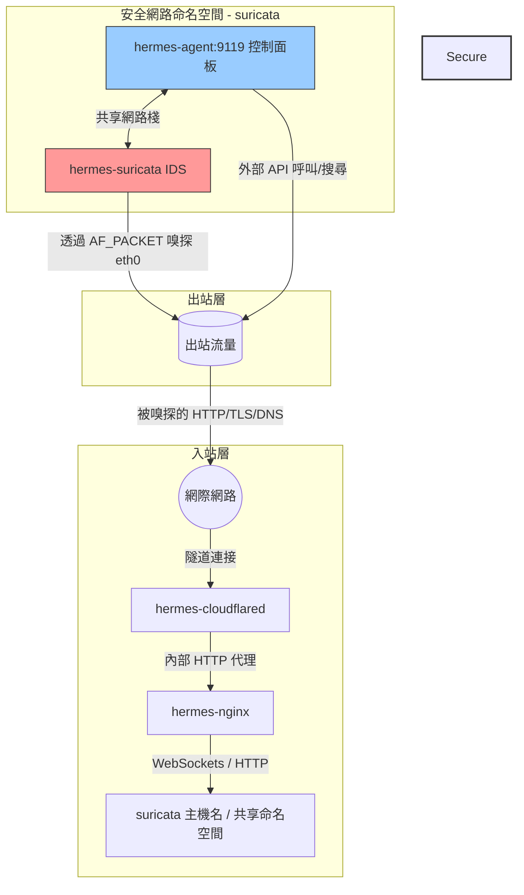

# 安全 Hermes Agent 主機技術棧

適用於 Nous Research **Hermes Agent** 的生產就緒、高度安全且支援出站流量監控的 Docker Compose 部署包。

本部署方案具備由 Cloudflare Tunnel 和 Nginx 反向代理構建的多層入站防禦，並結合了在共享網路命名空間內運行的 **Suricata 入侵檢測系統 (IDS)** 進行內聯出站封包嗅探。

---

## 📐 架構設計

下圖展示了外部流量如何安全地到達 Agent 控制面板（入站），以及 Agent 的所有出站請求在訪問網際網路之前如何被 Suricata 進行內聯分析（出站）：


### 網路流向圖


---

## 🛡 為什麼我們需要在 Docker 中運行這些服務

每個組件都經過容器化與精心編排，以滿足特定的架構和安全職責：

### 1. Cloudflared (入站隧道)
*   **為什麼需要它**：它建立一個僅出站的連接到 Cloudflare 邊緣網路，將公共網域名稱對應到我們本地的 Nginx 反向代理。
*   **安全價值**：免去了在路由器上配置通訊埠轉發、分配公網靜態 IP 或將通訊埠直接暴露給公網的風險，使宿主機在外部通訊埠掃描中處於完全隱身狀態。

### 2. Nginx (反向代理與邊緣控制器)
*   **為什麼需要它**：作為 Agent 控制面板前側的流量管理器。
*   **安全價值**：
    *   注入安全回應標頭（`X-Frame-Options`、`Content-Security-Policy` 等），防範點擊劫持和工作階段劫持。
    *   實制限流機制，以防止針對控制面板的暴力破解或拒絕服務 (DoS) 攻擊。
    *   處理 `ttyd` 內嵌瀏覽器終端機所需的 WebSocket 協定升級對應。

### 3. Hermes Agent (AI 核心與 Web 控制面板)
*   **為什麼需要它**：託管 Nous Research AI Agent 本身。它在通訊埠 `9119` 上運行 FastAPI 控制面板服務，提供 Web 介面與 PTY 終端機連線。
*   **安全價值**：容器將 Agent 的檔案操作與宿主機隔離。至關重要的是，該容器運行在**網路用戶端模式** (`network_mode: "service:hermes-suricata"`)，這意味著它沒有獨立的網路介面卡，而是共享 Suricata 的網路命名空間。

### 4. Suricata (出站入侵檢測系統)
*   **為什麼需要它**：分析流出 AI Agent 的網路封包。
*   **安全價值**：由於 LLM Agent 可以運行任意程式碼、執行終端機指令並執行基於工具的網頁請求，它們極易受到提示詞注入、越獄或指令劫持的攻擊。攻擊者可能會誘導 Agent 下載惡意指令碼、觸發反彈 Shell 或洩取敏感資料。Suricata 作為獨立於應用的網路防火牆和稽核記錄器，嗅探虛擬網卡上的所有出站和入站流量。
*   **Suricata 在此方案中的卓越優勢**：
    *   **零旁路網路命名空間共享**：藉由 Docker 的 `network_mode: "service:hermes-suricata"`，Hermes Agent 容器沒有自己的網路介面。它將所有流量直接路由通過 Suricata 的網路棧。Agent 無法繞過或停用監控引擎，因為它們共享完全相同的核心網路命名空間。
    *   **最小特權隔離**：傳統的網路嗅探需要以宿主機網路模式 (`--net=host`) 運行工具，從而暴露了宿主機的全部網卡。而 Suricata 僅在隔離的容器網路命名空間內運行，使用 `CAP_NET_RAW` 權限通過 `AF_PACKET` 嗅探 `eth0` 介面。即使 Suricata 自身受到封包解析器漏洞的攻擊，攻擊也完全被限制在容器命名空間內。
    *   **高性能 AF_PACKET 零拷貝**：Suricata 在零拷貝環形緩衝區模式下利用 Linux `AF_PACKET`。這使其能夠以極低的延遲直接從核心空間記憶體中擷取並分析封包，確保不會對 AI Agent 的推論和網路請求帶來效能損失。
    *   **動態協定及應用層檢測**：攻擊者經常嘗試通過標準通訊埠（如通過 443 通訊埠的反彈 Shell）來隱藏惡意流量。Suricata 可以動態解碼應用層協定（HTTP, TLS, DNS, SSH, SMTP），無論其使用何種通訊埠，從而提取並稽核 TLS 伺服器名稱指示 (SNI)、DNS 查詢記錄和 HTTP 請求標頭。
    *   **統一的 IDS 和日誌記錄 (Eve JSON)**：Suricata 不僅能根據規則比對進行警報，還可以作為全面的網路安全監視器 (NSM)。它輸出統一的、結構化的 JSON 日誌 (`eve.json`)，記錄每一次網路流、DNS 交易和 TLS 協商，極大地方便了與 SIEM 或自訂日誌解析器的整合。

---

## ⚙ 安裝與運行

### 1. 前提條件
確保您已安裝 **Docker** 和 **Docker Compose**（或在 macOS 上運行 Colima）。

### 2. 配置環境變數
透過複製範例範本在根目錄下建立一個 `.env` 檔案：
```bash
cp .env.sample .env
```
然後在 `.env` 中配置您的 API 金鑰：
```env
CLOUDFLARE_TUNNEL_TOKEN=your_cloudflare_tunnel_token

# 服務商金鑰（選配但推薦）
DEEPINFRA_API_KEY=your_deepinfra_key
AWS_ACCESS_KEY_ID=your_aws_key
AWS_SECRET_ACCESS_KEY=your_aws_secret_key
BRAVE_API_KEY=your_brave_search_key
PERPLEXITY_API_KEY=your_perplexity_key
```

### 3. 運行技術棧
以幕後程式模式啟動所有服務：
```bash
docker-compose up -d
```

### 4. 監控安全告警
即時查看 Suricata 的告警資訊：
```bash
tail -f suricata_log/fast.log
```
或者檢查結構化的事件流：
```bash
tail -f suricata_log/eve.json
```
